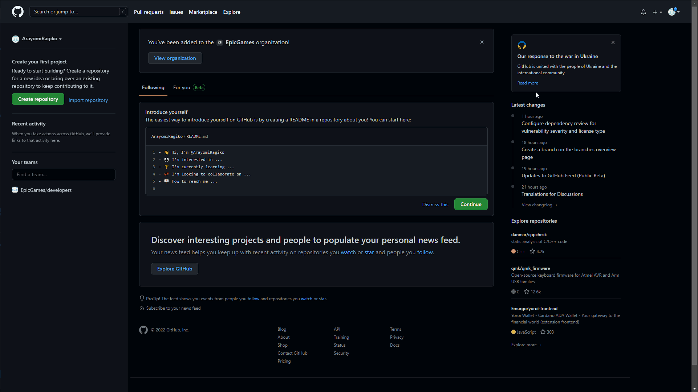

# Git, GitHub и GitHub Pages

## Первые шаги

1. Система контроля версий — система, записывающая изменения в файл или набор файлов в течение времени и позволяющая вернуться позже к определённой версии. 
    Git — самая распространённая система для контроля версий.
1. GitHub — платформа для хостинга удалённых репозиториев.
1. GitHub Pages — бесплатный хостинг от GitHub для публикации статических веб-сайтов прямо из репозиториев. С помощью него можно одной командой опубликовать в общий доступ сайт на MkDocs.

Перед дальнейшей работой надо:

1. Скачать и установить [Git](https://git-scm.com/downloads).
1. Зарегистрироваться в [GitHub](https://github.com/).

## SSH

Для упрощения работы с GitHub надо сгенерировать SSH-ключ и закрепить его за аккаунтом. [Подробнее об SSH-ключе](https://selectel.ru/blog/ssh-keys/).

| Шаг | Описание | Скриншот |
|---|---|---|
| Генерация ключа | Ввести в командной строке `ssh-keygen`. После этого выйдут два запроса, на которые можно просто нажимать Enter:  1. В первом он запросит название файла для ключа — по умолчанию он его назовёт id-rsa. 2. Во втором он предложит сделать дополнительный пароль для защиты ключа — по умолчанию пароль не будет задан |  |
| Переход в папку с ключом | Ввести `cd .ssh`. Если не менять название файла при создании — в папке `.ssh` должен лежать файл `id-rsa.pub`.  Если поменять — надо ориентироваться на файл с расширением `.pub` |  |
| Чтение публичного ключа | Ввести `cat id-rsa.pub` (или `cat [ваше-имя-файла].pub`).   Выделить и скопировать весь код, который появился в окне терминала |  |
| Сохранение публичного ключа в GitHub | В GitHub перейти в "Settings"→"SSH and GPG keys"→"New SSH key".  Вставить, назвать (Например, "Home-PC") и сохранить ключ |  |

## Cоздание репозитория

1. Нажмите на кнопку New.
1. В появившемся окне введите название репозитория.
1. Нажмите Create repository.

После этого надо вернуться в командную строку и последовательно ввести команды:

| Команда | Описание |
|---|---|
| `git init` | Инициализировать систему контроля версий в папке сайта |
| `git add .` | Попросить Git отслеживать все файлы в папке по пути `.` |
| `git commit -m “git init"` | Создать первый коммит |
| `git branch -m main` | Создать главную (main) ветка |
| `git remote add origin git@github.com:[ИмяВашегоАккаунта]/[название-вашего-репозитория].git` | Привязать локальный репозиторий к удалённому в GitHub аккаунте |
| `git push -u origin main` | Отправить локальные данные в удалённый репозиторий |

## Публикация с помощью GitHub Pages

Если получилось выложить репозиторий в GitHub — осталось только 2 действия:

1. Создать файл `.gitignore`, в котором написать `site`.
1. Ввести команду `mkdocs gh-deploy`.

Если всё пройдёт без ошибок — сайт выложится через несколько минут и будет доступен любому желающему по ссылке из командной строки.

Не забудьте закомитить и запушить файл `.gitignore` в ветку `main`. 