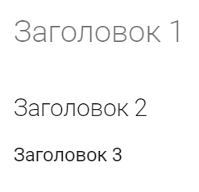

---
hide:
  - navigation
---

# Синтаксис Markdown

Markdown (MD) — легковесный язык разметки, который легко преобразуется в HTML. Простой синтаксис языка делает его читабельным в исходном виде, поэтому его часто используют для документации.

Помимо MkDocs MD используется ещё в Jekyll, Hugo, Gatsby и прочих генераторах статических сайтов. Также на Sphinx существуют расширения, которые позволяют использовать MD вместо reStructuredText (RST).

В документе описаны основы синтаксиса, подбронее в [полном гайде](https://www.markdownguide.org/extended-syntax/).

## Заголовки

Для заголовков используется символ `#`. Чем глубже вложенность, тем больше символов (6 — максимум).

{ align=right }
```markdown
# Заголовок 1
## Заголовок 2
### Заголовок 3
```
<br>

## Форматирование текста

1. **Жирный**: `**текст**` or `__текст__`.
1. *Курсив*: `*текст*` or `_текст_`.
1. ~~Зачеркнутый~~: `~~текст~~`.

```markdown
**Жирный**
*Курсив*
~~Зачеркнутый~~
```

> **Примечание:** синтаксис зачеркнутого текста верный, но в используемой теме MkDocs он не [поддерживается](https://github.com/mkdocs/mkdocs/issues/868). В других условиях, _скорее всего_, будет работать.

## Списки

1. **Маркированный список**: можно использовать `-` или `*`.
1. **Нумерованный список**: можно использовать `1.` `2.` `3.` и т.д. или просто `1.` `1.` `1.` — нумерация проставится автоматически.
    
> **Примечание:** Второй вариант (`1.` `1.` `1.`) может быть удобнее, т. к. позволяет не менять всю нумерацию при добавлении элемента в середину списка. Также только этот способ позволяет создавать многоуровневые списки.

```markdown
- элемент 1:
    - элемент 1.1;
    - элемент 1.1;
- элемент 2.
---
1. Первый.
    1. Первый А.
    1. Первый B.
2. Второй.
---
1. Первый.
1. Второй.
1. Третий.
```

- элемент 1:
    - элемент 1.1;
    - элемент 1.1;
- элемент 2.
---
1. Первый.
    1. Первый А.
    1. Первый B.
2. Второй.
---
1. Первый.
1. Второй.
1. Третий.

> **Примечание:** между списками должно быть разделение другими элементами или текстом, иначе они будут сливаться.

## Ссылки

Конструкция: `[Текст ссылки](URL)`.

### Внутренняя ссылка

```markdown
[Кратко о Docs-as-Code](index.md).
```

[Кратко о Docs-as-Code](index.md).

> **Примечание:** внутренняя ссылка на главную страницу — относительный путь на файл `index.md`.

### Внешняя ссылка

```markdown
[Текст ссылки](http://example.com).
```

[Текст ссылки](http://example.com).

## Изображения

Конструкция: ``.

### Локальное изображение

```markdown

```


### Внешнее изображение

```markdown

```


## Код
1. **Код в тексте**: нужно заключать слова в обратные апострофы `` `code` ``.
1. **Блоки кода**: абзац заключается в тройные апострофы.

```markdown

    ```python
    def hello():
    print("Hello, Markdown!")
    ```

```

```python
def hello():
print("Hello, Markdown!")
```

## Примечания и цитаты

Конструкция: `>`.

```markdown
> Это цитата.
```

> Это цитата.

Любое форматирование текста будет работать в цитате, поэтому с помощью этой конструкции можно оформлять примечания:

```markdown
> **Примечание:** это примечание.
```

> **Примечание:** это примечание.

## Разделитель (горизонтальная линия)

Конструкция: `---` или `***`.

```markdown
---
```
---

## Таблицы

Конструкция:

```markdown
| Заголовок 1 | Заголовок 2 |
| --- | --- |
| Строка 1    | Данные     |
| Строка 2    | Данные     |
```

| Заголовок 1 | Заголовок 2 |
| --- | --- |
| Строка 1    | Данные     |
| Строка 2    | Данные     |

> **Примечание:** таблицы — самое слабое место MD. Для создания больших таблиц советую использовать [генератор таблиц](https://www.tablesgenerator.com/markdown_tables).

## HTML

В MD без каких-то дополнительных конструкций вставляется работающий HTML. Если какие-то элементы вёрстки выглядят плохо в чистом MD — можно использовать [синтаксис HTML](https://www.w3schools.com/html/).

Например, можно использовать `<br>` в тексте для переноса на другую строчку. Особенно полезно бывает в таблицах.