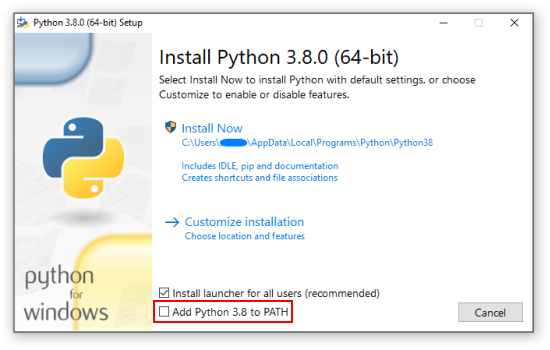
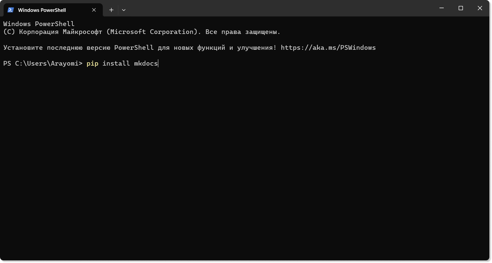
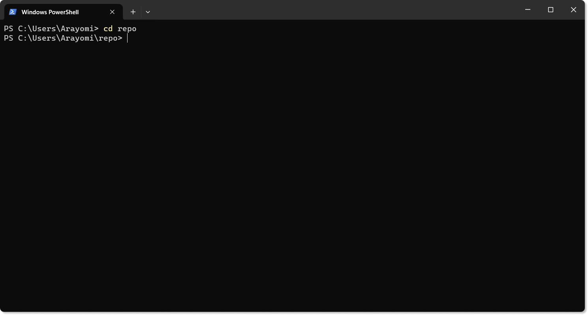
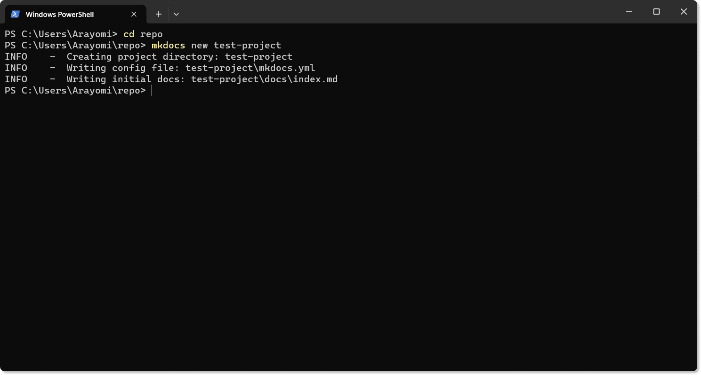
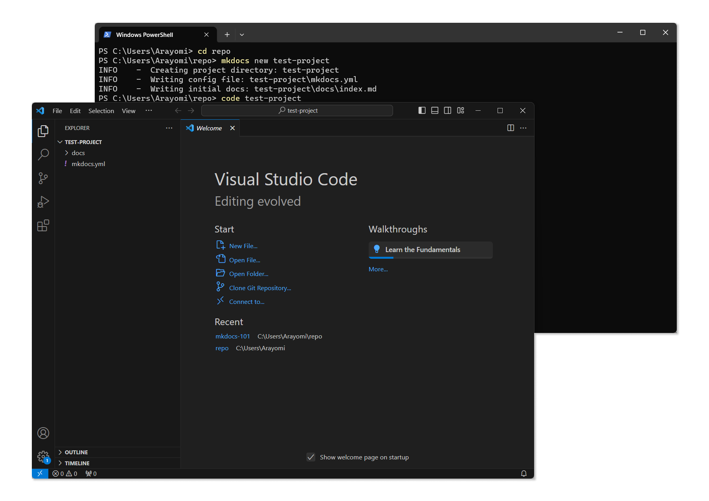
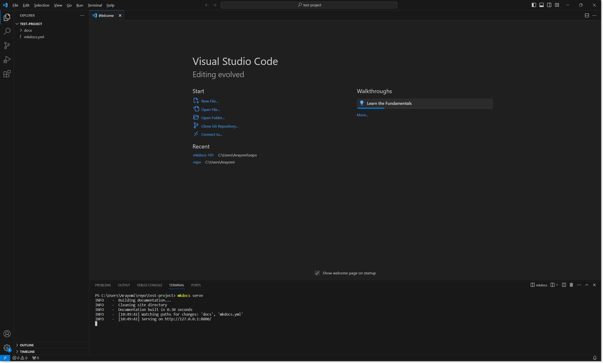
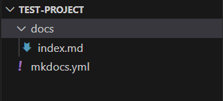
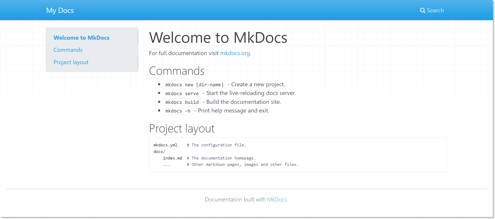

---
hide:
  - navigation
---

# MkDocs

MkDocs — это генератор статических сайтов, который позволяет одной командой создать *красивый* сайт для вашей документации. Для работы с ним вам не нужно знать HTML, CSS и JavaScript.

Обязательно к установке:

1. [Python](https://www.python.org/downloads/) — писать код на Python вам не придётся, он просто нужен для работы MkDocs.
1. [VSCode](https://code.visualstudio.com/) — легковесный редактор кода. Необязательно использовать именно этот, но если у вас нет других личных предпочтений, — советую начать с него. 
1. [MkDocs](https://www.mkdocs.org/getting-started/) — сам MkDocs. Там нет каких-то файлов для скачивания, но можно почитать более подробную инструкцию по MkDocs.
    Подробнее об установке [описано ниже](#mkdocs_1).

При установке Python не забудьте проставить галочку "Add Python to PATH":

Если пропустили, [на этом сайте](https://realpython.com/add-python-to-path/) есть подробная инструкция, как можно добавить Python в PATH после установки.

В крайнем случае: переустановите Python и поставьте галочку.

??? info "Скриншот"

    

## Установка Mkdocs и создание проекта

Большая часть работы будет происходить в терминале (Unix) или в PowerShell (Windows). Примеры будут для PowerShell, но большинство команд актуально и для Unix-систем.

| Шаг | Скриншот |
|---|---|
| Ввести в командной строке:<br>`pip install mkdocs`<br><br>Если `pip` не работает — может помочь перезагрузка компьютера  | { width="800" } |
| С помощью команды `cd` перейти в папку, в которой будет создаваться репозиторий сайта.<br><br>В примере папка находится в `C:\Users\Arayomi\repo`. <br><br>По умолчанию PowerShell открывается в `C:\User\Arayomi`. Поэтому команда выглядит: `cd repo` | { width="800" } |
| В нужной папке ввести команду: `mkdocs new project-name`.<br><br>Вместо `project-name` можно ввести любое имя для будущего проекта.<br>Его можно будет потом изменить.<br><br>Папка с сайтом (репозиторий) будет называться так же, как и проект | { width="800" } |
| Чтобы открыть проект в VS Code, надо ввести команду:<br>`code [абсолютный/относительный путь до репозитория]`.<br><br>В примере в команде пишется относительный путь:<br>`code test-project` | { width="800" } |
| VS Code позволяет открыть PowerShell внутри редактора.<br>Для этого надо нажать на "Terminal" → "New Terminal" (или Ctrl+Shift+\`).<br>В новом терминале введите команду `mkdocs serve`.<br>С помощью этой команды вы локально собрали ваш сайт по адресу `127.0.0.1:8000`. | { width="800" } |

## Структура проекта

Структура проекта сразу после создания:

{ align=right }

1. Папка `docs` — основная папка, в которой лежат все документы проекта.
1. `index.md` — главная страница сайта. Открывается по умолчанию при открытии сайта.
1. `mkdocs.yml` — файл с конфигурацией сайта.

### Конфигурация сайта

Первые настройки сайта начинаются с файла `mkdocs.yml`. Сразу после создания проекта файл выглядит примерно так:

```yml
site_name: My Docs
```
А сам сайт выглядит так:

??? info "Скриншот"

    

Это стандартная тема для сайтов сгенерированных с помощью MkDocs. В интернете много разных тем для MkDocs, основные можно посмотреть [по ссылке](https://github.com/mkdocs/mkdocs/wiki/MkDocs-Themes).
Мне нравится тема [`material`](https://squidfunk.github.io/mkdocs-material/) — на этом сайте используется она же. Примеры буду приводить с ней же.

> **Примечание:** Какой-то функционал описанный в документации может не работать или работать некорретно в других темах. Если вы используете другую тему — изучайте документацию самой темы. 

Советую отключать билд сайта каждый раз, когда вы редактируете файл конфигурации. Многие плагины и изменения не будут работать до перезапуска.

Для установки `material`:

1. Тему сначала надо скачать. Введите в командной строке:
    
```bash
pip install mkdocs-material
```

2. В файле `mkdocs.yml` добавьте настройку:

```yml
theme: 
  name: material
```

> **Примечание:** Отступы между вложенными частями в файле конфигурации можете выбирать сами, но они должны быть одинаковыми во всём файле.

3. Запустите билд (`mkdocs serve`) и радуйтесь красивой теме вашего сайта.

Дополнительные плагины и настройки, которые могут быть необходимы в документации:

| <div style="width:8em">Параметр</div> 	| Описание 	|
|---	|---	|
| `language: ru` 	| Вкладывается в `theme` и определяет язык темы. Для документации на английском языке настройку можно не менять, а для других языков смотрите обозначения в документации самой темы. [Ссылка для material](https://squidfunk.github.io/mkdocs-material/setup/changing-the-language/?h=langu#site-language) 	|
| `plugins:` 	| После двоеточия записывается список плагинов, которые вы хотите использовать на сайте. Рекомендую использовать `glightbox` — он позволяет открывать картинки в увеличенном размере на сайте кликом мыши.<br>Без него картинки буду статичны. Плагины необходимо устанавливать через pip 	|
| `nav:` 	| Эта настройка определяет навигацию на всём сайте. Помогает выстроить точный порядок файлов на сайте. Например, на этом сайте я её использовал, чтобы страницы шли не в алфавитном порядке, а в хронологическом. <br>[Подробнее о настройке](https://www.mkdocs.org/user-guide/configuration/#nav) 	|